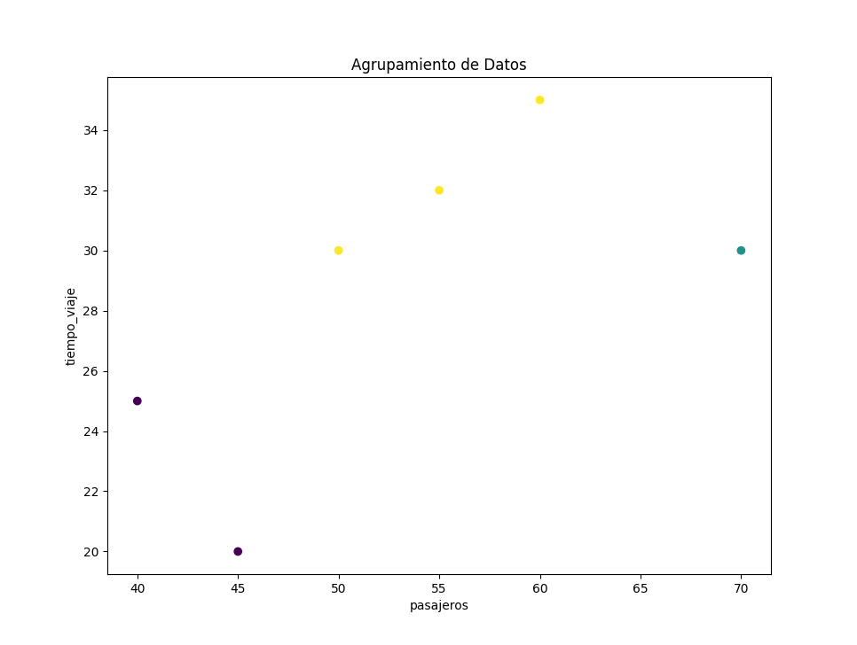

# Proyecto de Agrupamiento en Transporte Masivo

## Descripción

Este proyecto utiliza técnicas de **aprendizaje no supervisado** para agrupar rutas de transporte masivo según factores como el número de pasajeros, el clima, el tiempo de viaje y el nivel de congestión. En este caso, aplicamos el algoritmo de **K-means** para identificar grupos (clusters) que comparten características similares, lo cual podría ayudar a identificar patrones en el comportamiento del transporte.

El propósito principal es explorar cómo las rutas de transporte pueden agruparse en función de estos factores y ofrecer una herramienta que facilite la identificación de patrones en los datos, lo que podría ser útil para mejorar la planificación y la eficiencia del sistema de transporte.

## Dataset

El dataset contiene información simulada sobre varias rutas de transporte, incluyendo:
- **Rutas**: Identificador de la ruta (ej. A, B, C).
- **Pasajeros**: Número promedio de pasajeros por día.
- **Tiempo de viaje**: Duración promedio del viaje en minutos.
- **Clima**: Condiciones climáticas (soleado, nublado, lluvioso).
- **Congestión**: Nivel de congestión (alta, media, baja).

El archivo con el dataset simulado se encuentra en la carpeta `data/transporte.csv`.

## Instalación y configuración

Para ejecutar este proyecto, asegúrate de tener **Python 3.x** instalado y sigue los siguientes pasos:

1. Clona este repositorio:
   ```bash
   git clone https://github.com/usuario/proyecto_agrupamiento_transporte.git
2. Navega a la carpeta del proyecto:
   ```bash
    cd proyecto_agrupamiento_transporte
3. Crea un entorno virtual (opcional pero recomendado):
   ```bash
    python -m venv venv
4. Instala las dependencias necesarias:
   ```bash
    pip install -r requirements.txt

## Uso del Proyecto
Este proyecto está organizado de la siguiente manera:

- src/main.py: Archivo principal que ejecuta el flujo del proyecto. Carga los datos, ejecuta el algoritmo K-means y muestra los resultados en un gráfico.
- src/clustering.py: Contiene las funciones para ejecutar el algoritmo de agrupamiento (K-means) y visualizar los resultados.
- data/transporte.csv: Dataset simulado que contiene información sobre las rutas de transporte y las características a analizar.

## Ejecutar el proyecto
1. Asegúrate de que los datos estén en el archivo data/transporte.csv.
2. Ejecuta el archivo principal:
   ```bash
    python src/main.py
3. El programa cargará los datos, aplicará el algoritmo de K-means para agrupar las rutas, y mostrará los resultados en un gráfico.

## Ejemplo de salida
Al ejecutar el proyecto, verás un gráfico con los grupos formados. El gráfico será algo similar a esto:




## Estructura del proyecto

    proyecto_agrupamiento_transporte/
    │
    ├── data/
    │   └── transporte.csv        # Archivo de datos (dataset simulado)
    │
    ├── src/
    │   ├── main.py               # Archivo principal que ejecuta el modelo
    │   ├── clustering.py         # Archivo con la lógica del modelo de aprendizaje no supervisado
    │
    ├── README.md                 # Este archivo, descripción del proyecto
    ├── requirements.txt          # Lista de dependencias necesarias
    └── .gitignore                # Archivos ignorados por Git
